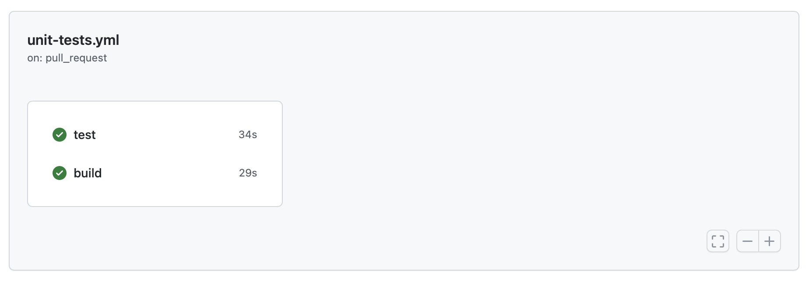

Let's start by adding a build step after installing our dependencies and before running our test.

Building the application is a verification step in-and-of itself since we're using TypeScript. (I'll leave it as an exercise to the reader if you want to run some other type checker like `tsc`, but this gets the jobs done.)

```yml
name: Unit Tests

on:
  push:
    branches: [main]
  pull_request:
    branches: [main]

jobs:
  build-and-test:
    runs-on: ubuntu-latest

    steps:
      - name: Checkout respository
        uses: actions/checkout@v3
      - name: Setup Node
        uses: actions/setup-node@v3
      - run: npm ci
        name: Install modules from npm
      - run: npm run build
        name: Build the application
      - run: npm test
        name: Run the tests
```

You'll notice that I also named the steps. This is totally optional. I like it, but it really doesn't matter much.


(No, I don't know what to do about the inconsistent capitalization.)

# Adding a Second Job

What if we want `build` and `test` to run in parallel? We _could_ try something like this:

```yml
name: Unit Tests

on:
  push:
    branches: [main]
  pull_request:
    branches: [main]

jobs:
  test:
    runs-on: ubuntu-latest

    steps:
      - name: Checkout respository
        uses: actions/checkout@v3
      - name: Setup Node
        uses: actions/setup-node@v3
      - run: npm ci
        name: Install modules from npm
      - run: npm test
        name: Run the tests
  build:
    runs-on: ubuntu-latest

    steps:
      - name: Checkout respository
        uses: actions/checkout@v3
      - name: Setup Node
        uses: actions/setup-node@v3
      - run: npm ci
        name: Install modules from npm
      - run: npm run build
        name: Build the application
```

You'll now have to jobs running in parallel:


There seems to be some amount of duplication though, right? Part of this is because they're running in parallel. You can actually see this in the **Actions** tab in your repository:



It doesn't look like much, but trust me, we're running in parallel. That said, we're still downloading and installing our assets twice.
