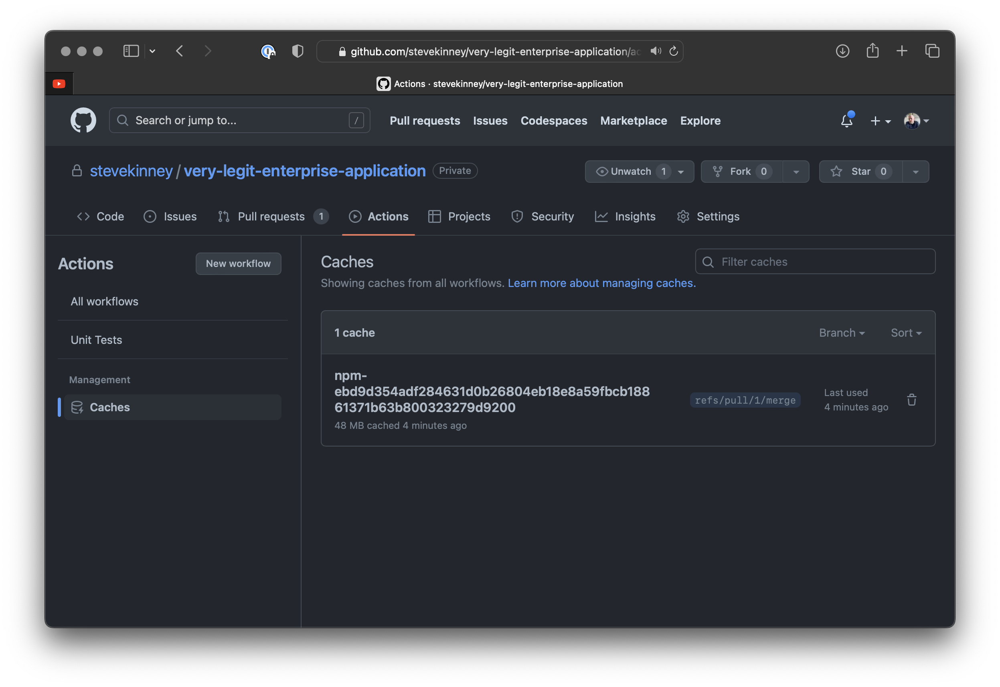
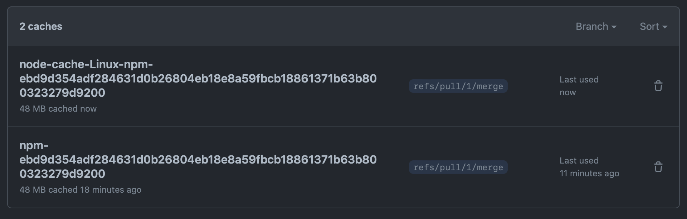

# Caching Assets Between Jobs

Let's _start_ by using `actions/cache@v3` to cache the npm cache between runs.

```yaml
steps:
  - name: Checkout respository
    uses: actions/checkout@v3
  - name: Setup Node
    uses: actions/setup-node@v3
  - uses: actions/cache@v3 # 👀
    id: npm-cache # 👀
    with: # 👀
      path: ~/.npm # 👀
      key: npm-${{ hashFiles('**/package-lock.json') }} # 👀
  - run: npm ci
    name: Install modules from npm
  - run: npm test
    name: Run the tests
```

If we look at the Post Run for `actions/cache@v3`, we'll see that we wrote to the cache.


We can also navigate to it in the UI by going to the **Actions** tab and selecting **Caches** from the sidebar.


In my very silly example, we'll see that it cut the total time down by 4 seconds. This may not seem like a lot, but it's 33%.


## Quick Exercise/Experiment

Go ahead and add it to the `build` job too and observe what happens.

## Collapsing Our Code

As you can imagine, this is a pretty common task. So common that `actions/setup-node@v3` has a little helper that will do this for you.

```yml
- name: Setup Node
  uses: actions/setup-node@v3
  with:
    node-version: 18
    cache: 'npm'
```

`actions/setup-node@v3` names it a little differently, so you'll end up with a different cache, but that's okay.



But, like just because `actions/setup-node@v3` does it for you, it does't mean that you won't want this functionality elsewhere. Here are some use cases off the top of my mind:

- You have a job or step that builds your assets and as long as something hasn't changed, then we want to just use whatever we had last time.
- For example, we have a script that install Temporal CLI along with the rest of our dependencies. I might choose to cache so that I'm _not_ re-downloading it.
