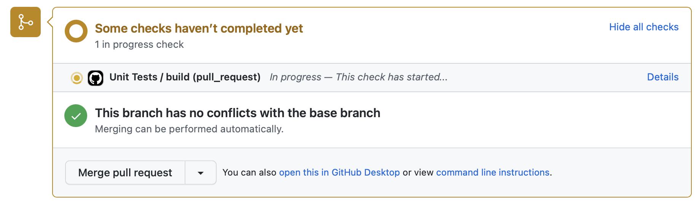

# Getting Started with Github Actions

## The High Level

[Github Actions](https://github.com/features/actions) is a system for running workflows on Github's infrastructure to "do stuff when things happen". More specifically:

- Your Github Actions workflows live in the `.github/workflows` directory in your repository.
- Github Actions will trigger when an [event](Github%20Actions%20Events.md) happens and kick off a workflow that consists of one or more jobs.

## A First Workflow

Let's take a look at a very simple workflow that will run our unit tests.

```yml
name: Unit Tests

on:
  push:
    branches: [main]
  pull_request:
    branches: [main]

jobs:
  build-and-test:
    runs-on: ubuntu-latest

    steps:
      - uses: actions/checkout@v3
      - name: Setup Node
        uses: actions/setup-node@v3
      - run: npm ci
      - run: npm test
```



Okay, so what's going on here:

- `name`: Signifies the name of the worklow, which you can see in the screenshot.
- `on`: What kind of [event](Github%20Actions%20Events.md) are we listening for? In this case, we're listening for two events:
  - A `push` to the main branch.
  - A `pull_request` that targets the main branch.
- `jobs`: A list of jobs that will run in parallel. Right now, we only have one and it's called `build-and-test`.
- `steps` each job has one or more steps. These steps run synchronously (one after the other). Right now, we have the following steps:
  - `actions/checkout@v3`: This one is _super_ important. It checks out the repository. For most actions where you might want to run tests, build your application, deploy your application, etc., you're probably going to need the repository, right?
  - `actions/setup-node@v3`: We gave this one the cute name "Setup Node" as well. But, this one does what it says on the tin. It installs Node.js onto whatever container your action is running in.
  - `run`: I'll get into this in a bit, but really, you have two major types of _things_ you can do: `run` commands and `use` actions. In this case, we're running `npm ci` and then `npm test`.

# Whoa, What is `npm ci`?

[`npm ci`](https://docs.npmjs.com/cli/v9/commands/npm-ci) is a variation on `npm install`, but it has a few important cavaets:

- It insists on you already having a `package-lock.json`.
- It will error out instead of updating `package-lock.json` if something doesn't match.
- It install all of the dependencies. I.e. you can't just use it to install one depenedency like `npm ci @testing-library/react` or something.
- It blows away `node_modules` if present.
- It doesn't write to `package.json`.


# Exercise: Add a Build Step

- Right now `build-and-test` only tests. Add a step that runs `npm run build` to the action
- **Bonus 1:**: Add a name to the step where we check out the repository.
- **Bonus 2:**: Run `npm run build` in parallel with `npm test`.