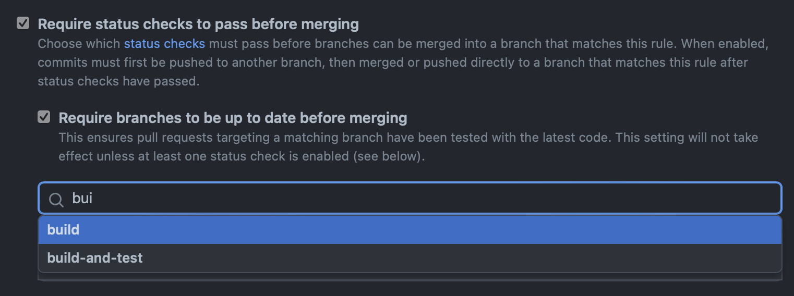

# Setting Up Branch Protections

You went through all of this work to make sure that you'd run your tests whenever you pushed a commit to a PR. You probably want to make sure that they actually stop someone from doing something silly, right?

In your repository's **Settings > Branch > Branch protection rules**, you can add some restrictions:

By default, this rule _does not_ apply to administrators of the repository—which is probably you right now, but there is an additional option at the bottom that enforces this for administrators as well.
