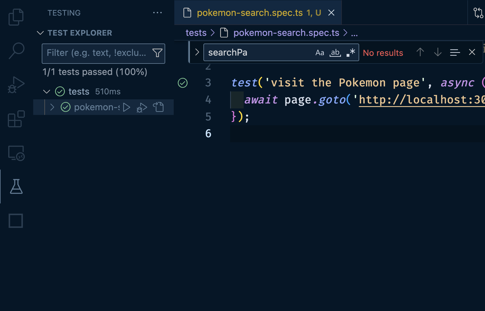

# Writing Some Simple Playwright Tests

Let's write some tests of our own. Inside of [our other repository](https://github.com/stevekinney/integration-testing-playground), we have a bunch of sample applications. (Make sure that server is up and running.)

## Testing Our Pokémon Search

We'll start by making a new file. I'm going to call mine, `tests/pokemon-search.spec.ts`, but as long as you end yours in `*.spec.ts`, it really doesn't matter.

Let's start with a simple test:

```ts
import { test, expect } from '@playwright/test';

test('visit the Pokemon page', async ({ page }) => {
  await page.goto('http://localhost:3000/pokemon-search');
});
```

You can run this test super easily by running the following command—just like we discussed before:

```
npx playwright test
```

That said, it leaves something to be design. I'm not getting the hit of dopamine that I would normally want. Instead, I'm going to use [that cool Visual Studio Code Extension](https://marketplace.visualstudio.com/items?itemName=ms-playwright.playwright) that I _keep_ trying to push on you.



## Using the Visual Studio Code Plugin

Now, you should see your test hanging out over in the sidebar. Go ahead and hit that play button.

You _should_ see a Chormium window open up with your (or, my—in this case) UI and navigated to the correct page.

But watch as I type this into my editor:

```ts
const searchInput = page.getByPlaceholder('Sear');
```

I can see in that Chromium browser what elements match. Whoa.

Let's finish out that test:

```ts
test('visit the Pokemon page and have a search input', async ({ page }) => {
  await page.goto('http://localhost:3000/pokemon-search');
  const searchInput = page.getByPlaceholder('Search Pokémon…');
});
```

And now we can run it from the sidebar as well. **Pro Tip**: If I am working on a particular test and I want to see re-run it. I can use `Command/Control ;` and the `L`. (Don't worry that becomes muscle memory fairly quickly.)

## Verifying That that the Search Works

```ts
test('visit the Pokemon page and have a search input', async ({ page }) => {
  await page.goto('http://localhost:3000/pokemon-search');
  const searchInput = page.getByPlaceholder('Search Pokémon…');
  await searchInput.type('Pika');
  page.getByRole('link', { name: 'Pikachu' });
});
```

I haven't made an assertion yet, but I think I've made my point about tests that _don't_ blow up at this point.

We can add an assertion though if we wanted to.

```ts
test('visit the Pokemon page and have a search input', async ({ page }) => {
  await page.goto('http://localhost:3000/pokemon-search');

  const searchInput = page.getByPlaceholder('Search Pokémon…');
  await searchInput.type('Pika');

  const link = page.getByRole('link', { name: 'Pikachu' });

  await link.click();

  expect(page.url()).toContain('/25');
});
```
